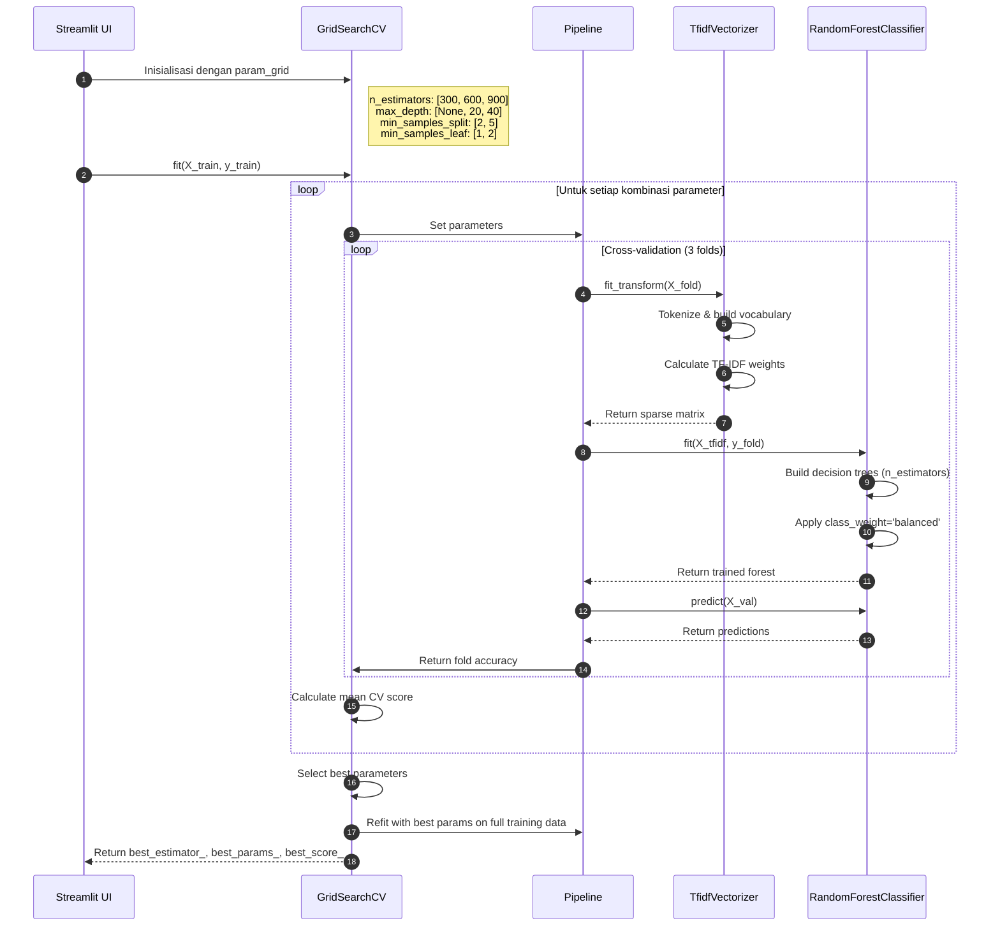
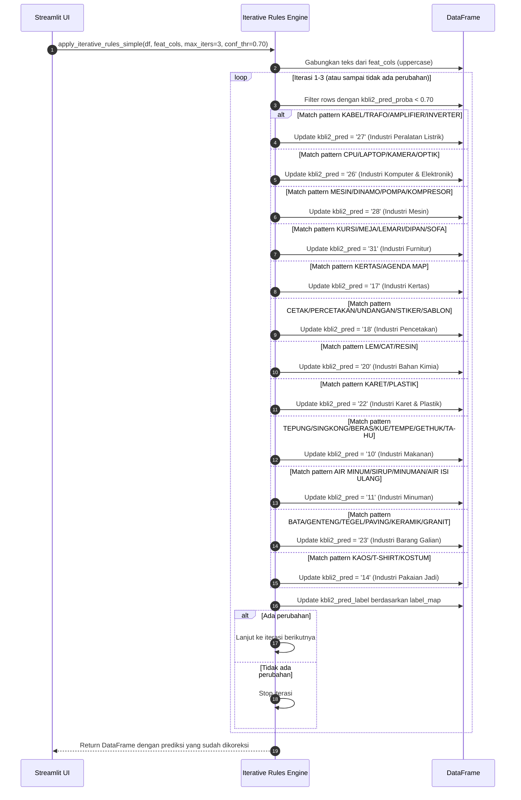
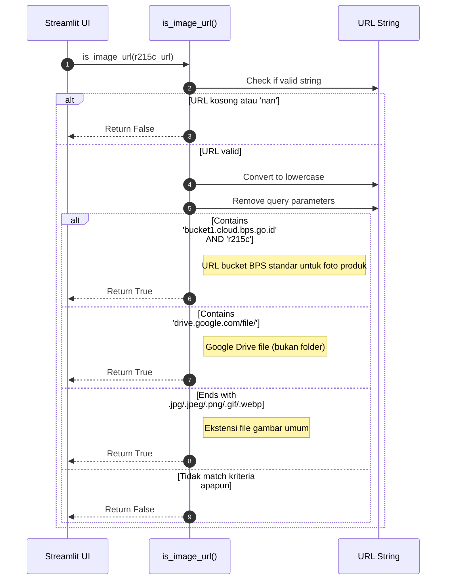
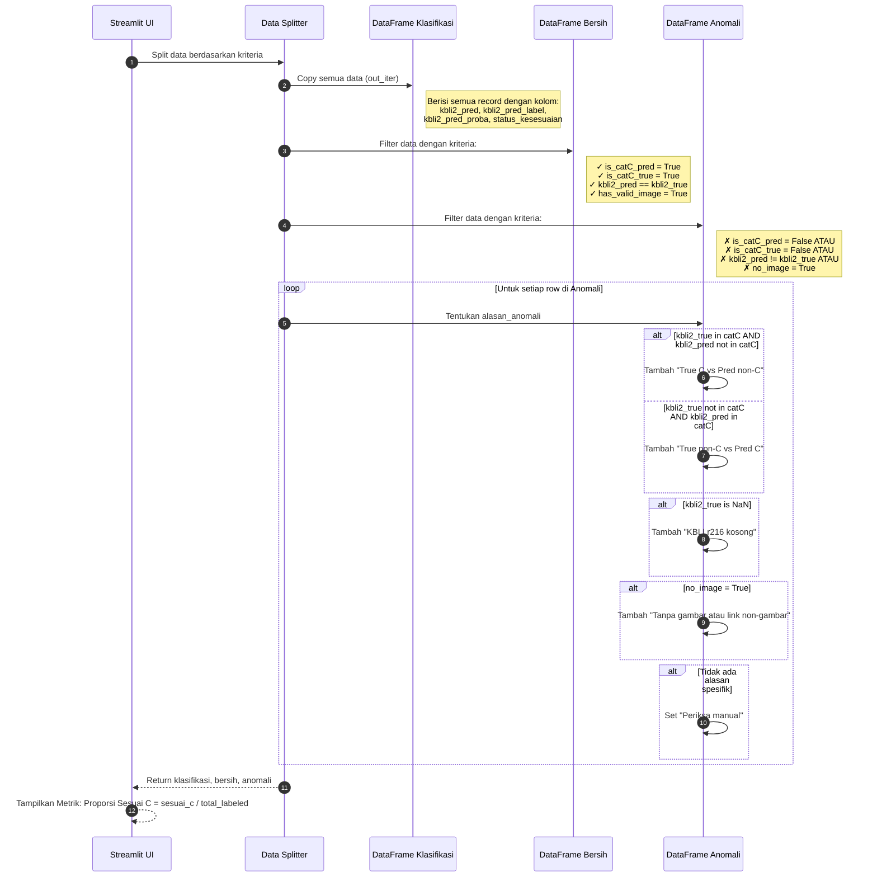

# Sequence Diagram - Klasifikasi KBLI 2 Digit

## Deskripsi Sistem
Sistem ini adalah aplikasi web berbasis **Streamlit** yang melakukan klasifikasi KBLI (Klasifikasi Baku Lapangan Usaha Indonesia) 2 digit menggunakan algoritma **TF-IDF + Random Forest** dengan **GridSearchCV** untuk hyperparameter tuning.

---

## Sequence Diagram Utama

```mermaid
sequenceDiagram
    autonumber
    actor User as User
    participant UI as Streamlit UI (app.py)
    participant Preprocessing as Data Preprocessing
    participant ML as ML Pipeline (Scikit-Learn)
    participant Output as Output Handler

    User->>UI: Upload file CSV/Excel
    UI->>Preprocessing: Baca file (pd.read_csv/read_excel)
    Preprocessing->>Preprocessing: Deteksi encoding (chardet)
    Preprocessing->>Preprocessing: Normalisasi kolom & strip spasi
    Preprocessing-->>UI: Return DataFrame mentah
    UI-->>User: Tampilkan Preview Data Mentah

    UI->>Preprocessing: split_business_owner(r213)
    Preprocessing->>Preprocessing: Parse nama bisnis dari r213
    Preprocessing->>Preprocessing: Extract nama pemilik dari <...>
    Preprocessing-->>UI: Return nama_bisnis, nama_pemilik, nama_pemilik_lain

    UI->>Preprocessing: Extract kbli2_true dari r216
    alt r216_value tersedia
        Preprocessing->>Preprocessing: Extract 2 digit pertama dari r216_value
    else r216_label tersedia
        Preprocessing->>Preprocessing: Extract kode dari format [XX]
    else Tidak ada r216
        Preprocessing-->>UI: kbli2_true = NaN
    end
    Preprocessing-->>UI: Return kbli2_true

    UI->>Preprocessing: Buat fitur text_all
    Preprocessing->>Preprocessing: Gabungkan r215a1_label + r215b + r215d
    Preprocessing-->>UI: Return text_all column

    UI->>ML: Build Pipeline (ColumnTransformer + RandomForest)
    ML->>ML: Setup TfidfVectorizer (ngram 1-2, min_df=3)
    ML->>ML: Setup RandomForestClassifier

    alt Cukup label (>= 50 samples, >= 2 classes)
        UI->>ML: GridSearchCV dengan param_grid
        ML->>ML: train_test_split (80/20, stratified)
        ML->>ML: Cross-validation (cv=3)
        ML->>ML: Fit dengan berbagai kombinasi hyperparameter
        ML-->>UI: Return best_model, best_params, best_score
        UI-->>User: Tampilkan Best Params & CV Score
    else Kelas jarang
        ML->>ML: Fit langsung dengan n_estimators=800
        ML-->>UI: Return trained model
        UI-->>User: Warning: Model tanpa GridSearchCV
    else Tidak cukup label
        ML->>ML: Fit dummy dengan random labels
        ML-->>UI: Return dummy model
        UI-->>User: Info: Model dummy untuk prediksi
    end

    UI->>ML: best_model.predict(X_all)
    ML-->>UI: Return kbli2_pred

    UI->>ML: best_model.predict_proba(X_all)
    ML-->>UI: Return kbli2_pred_proba (confidence)

    UI->>Preprocessing: apply_iterative_rules_simple()
    loop Max 3 iterasi
        Preprocessing->>Preprocessing: Cek confidence < 0.70
        Preprocessing->>Preprocessing: Apply keyword rules (KABEL->27, KURSI->31, dll)
        Preprocessing->>Preprocessing: Update prediksi jika match
    end
    Preprocessing-->>UI: Return updated predictions

    UI->>Preprocessing: Validasi Kategori C (kode 10-33)
    Preprocessing->>Preprocessing: Set is_catC_pred flag
    Preprocessing->>Preprocessing: Set is_catC_true flag
    Preprocessing-->>UI: Return category flags

    UI->>Preprocessing: is_image_url(r215c_url)
    Preprocessing->>Preprocessing: Cek bucket BPS / Google Drive / ekstensi gambar
    Preprocessing-->>UI: Return has_valid_image flag

    UI->>Preprocessing: Hitung status_kesesuaian
    Preprocessing->>Preprocessing: Compare kbli2_pred vs kbli2_true
    Preprocessing-->>UI: Return status (Sesuai C / Mismatch / dll)

    UI->>Output: Split data ke 3 kategori
    Output->>Output: klasifikasi = semua data
    Output->>Output: bersih = catC + match + punya gambar
    Output->>Output: anomali = non-catC / mismatch / tanpa gambar
    Output->>Output: Tambah alasan_anomali untuk data anomali
    Output-->>UI: Return 3 DataFrames

    UI-->>User: Tampilkan Metrik Akurasi (Proporsi Sesuai C)
    UI-->>User: Tampilkan Tabel Data Klasifikasi
    UI-->>User: Tampilkan Tabel Data Bersih
    UI-->>User: Tampilkan Tabel Data Anomali

    User->>UI: Klik Download CSV
    UI->>Output: Generate CSV files
    Output-->>User: Download klasifikasi_r216_vs_textC.csv
    Output-->>User: Download bersih_textC.csv
    Output-->>User: Download anomali_kbli.csv

    opt Simpan Model
        User->>UI: Centang "Simpan model ke file .joblib"
        UI->>Output: joblib.dump(best_model)
        Output-->>User: Konfirmasi: model_kbli2_rf_tfidf_grid.joblib tersimpan
    end
```

---

## Sequence Diagram: Proses GridSearchCV

---

## Sequence Diagram: Aturan Iteratif (Rule-Based Correction)

---

## Sequence Diagram: Validasi URL Gambar

---

## Sequence Diagram: Pembagian Data Output

---

## Ringkasan Alur Sistem

| Tahap | Komponen | Proses |
|-------|----------|--------|
| 1. Input | User → UI | Upload file CSV/Excel |
| 2. Parsing | Preprocessing | Baca file, deteksi encoding, normalisasi kolom |
| 3. Feature Engineering | Preprocessing | split_business_owner, extract kbli2_true, buat text_all |
| 4. Model Training | ML Pipeline | GridSearchCV dengan TF-IDF + RandomForest |
| 5. Prediction | ML Pipeline | predict() + predict_proba() |
| 6. Post-processing | Iterative Rules | Koreksi prediksi berdasarkan keyword |
| 7. Validation | Preprocessing | Cek kategori C, validasi URL gambar |
| 8. Split Data | Output Handler | Bagi ke klasifikasi/bersih/anomali |
| 9. Output | UI → User | Tampilkan tabel, download CSV, simpan model |

---

## Kode KBLI Kategori C (Industri Pengolahan)

| Kode | Label |
|------|-------|
| 10 | Industri Makanan |
| 11 | Industri Minuman |
| 12 | Industri Pengolahan Tembakau |
| 13 | Industri Tekstil |
| 14 | Industri Pakaian Jadi |
| 15 | Industri Kulit dan Alas Kaki |
| 16 | Industri Kayu |
| 17 | Industri Kertas |
| 18 | Industri Pencetakan dan Reproduksi Media Rekaman |
| 19 | Industri Produk dari Batu Bara dan Pengilangan Minyak Bumi |
| 20 | Industri Bahan Kimia dan Barang dari Bahan Kimia |
| 21 | Industri Farmasi, Produk Obat Kimia dan Obat Tradisional |
| 22 | Industri Karet, Barang dari Karet dan Plastik |
| 23 | Industri Barang Galian Bukan Logam |
| 24 | Industri Logam Dasar |
| 25 | Industri Barang dari Logam, Bukan Mesin dan Peralatannya |
| 26 | Industri Komputer, Barang Elektronik dan Optik |
| 27 | Industri Peralatan Listrik |
| 28 | Industri Mesin dan Perlengkapan |
| 29 | Industri Kendaraan Bermotor, Trailer dan Semi Trailer |
| 30 | Industri Alat Angkutan Lainnya |
| 31 | Industri Furnitur |
| 32 | Industri Pengolahan Lainnya |
| 33 | Jasa Reparasi dan Pemasangan Mesin dan Peralatan |
