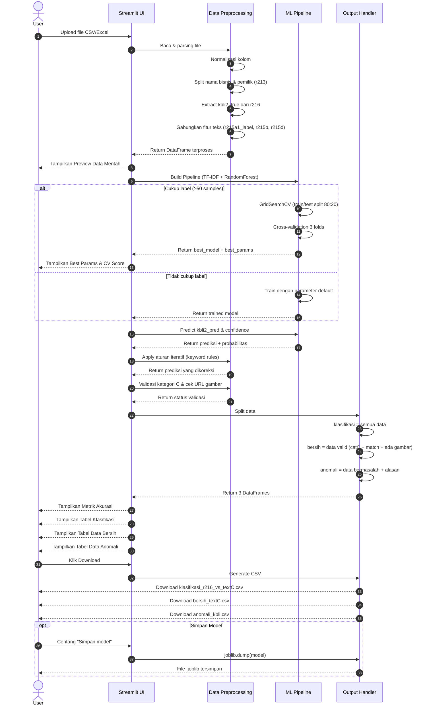

# Sequence Diagram Sederhana - Klasifikasi KBLI 2 Digit

## Ringkasan Alur

| No | Tahap | Deskripsi |
|----|-------|-----------|
| 1 | Upload | User upload file CSV/Excel |
| 2 | Preprocessing | Parsing, normalisasi, ekstrak fitur |
| 3 | Training | GridSearchCV dengan TF-IDF + RandomForest |
| 4 | Prediksi | Klasifikasi KBLI 2 digit + confidence |
| 5 | Koreksi | Aturan keyword untuk confidence rendah |
| 6 | Validasi | Cek kategori C & URL gambar |
| 7 | Split | Bagi ke klasifikasi/bersih/anomali |
| 8 | Download | Export hasil ke CSV |
